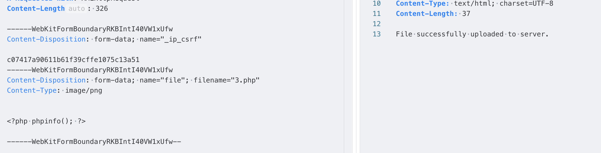
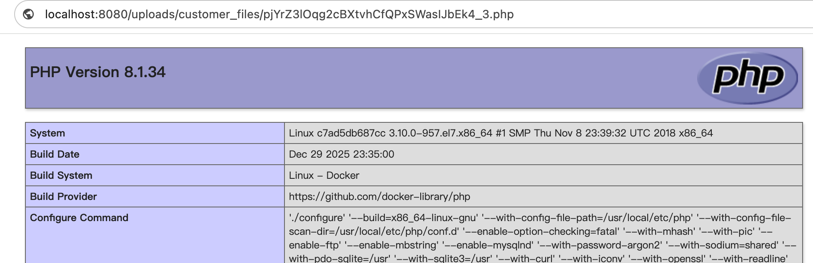

# InvoicePlane File upload vulnerability(CVE-2025-67084)
File upload vulnerability in InvoicePlane through 1.6.3 allows authenticated attackers to upload arbitrary PHP files into attachments, which can later be executed remotely, leading to Remote Code Execution (RCE). 
## Root Cause of the Vulnerability
The frontend restricts uploaded file extensions via the `acceptedFiles: acceptedExts` configuration.
```
var myDropzone = new Dropzone(document.body, { // Make the whole body a dropzone
        url: url_upload_file,
        thumbnailWidth: 80,
        thumbnailHeight: 80,
        parallelUploads: 20,
        uploadMultiple: false,
        dictFileTooBig: `<?php _trans('upload_dz_invalid_file_size'); ?>`,
        dictFileSizeUnits: {<?php _trans('upload_dz_size_units'); ?>},
        dictRemoveFileConfirmation: `<?php _trans('delete_attachment_warning'); ?>`,
        dictInvalidFileType: `<?php _trans('upload_dz_invalid_file_type'); ?>`,
        acceptedFiles: acceptedExts, // allowed .ext1,.ext2,.ext3, ...
        previewTemplate: previewTemplate,
        autoQueue: true, // Make sure the files aren't queued until manually added
        previewsContainer: '#previews', // Define the container to display the previews
        clickable: '.fileinput-button', // Define the element that should be used as click trigger to select files.
        init: function () {
            thisDropzone = this;
            $.getJSON(url_show_file,
                function (data) {
                    $.each(data, function (index, val) {
                        displayExistingFile(val);
                    });
                    thisDropzone.files.length && ! is_guest && removeAllFilesButtonShow(true);
                }
            );
        },
    })
```
The `upload_file` function in application/modules/upload/controllers/Upload.php fails to validate file extensions, relying solely on MIME type validation using the `validate_mime_type` function.
```
public function upload_file(int $customerId, string $url_key): void
    {
        if (empty($_FILES['file']['name'])) {
            $this->respond_message(400, 'upload_error_no_file');
        }

        $filename = $this->sanitize_file_name($_FILES['file']['name']);
        $filePath = $this->get_target_file_path($url_key, $filename);

        if (file_exists($filePath)) {
            $this->respond_message(409, 'upload_error_duplicate_file', $filename);
        }

        $tempFile = $_FILES['file']['tmp_name'];
        $this->validate_mime_type(mime_content_type($tempFile));
        $this->move_uploaded_file($tempFile, $filePath, $filename);

        $this->save_file_metadata($customerId, $url_key, $filename);

        $this->respond_message(200, 'upload_file_uploaded_successfully', $filename);
    }
```
The `validate_mime_type` function checks the file MIME type against a whitelist.
```
private function validate_mime_type(string $mimeType): void
    {
        $allowedTypes = array_values($this->content_types);
        if ( ! in_array($mimeType, $allowedTypes, true)) {
            $this->respond_message(415, 'upload_error_unsupported_file_type', $mimeType);
        }
    }
```
## Setup Environment
Execute the following command to start a vulnerable environment.
```
docker compose build
docker compose up -d
```
## Exploit


